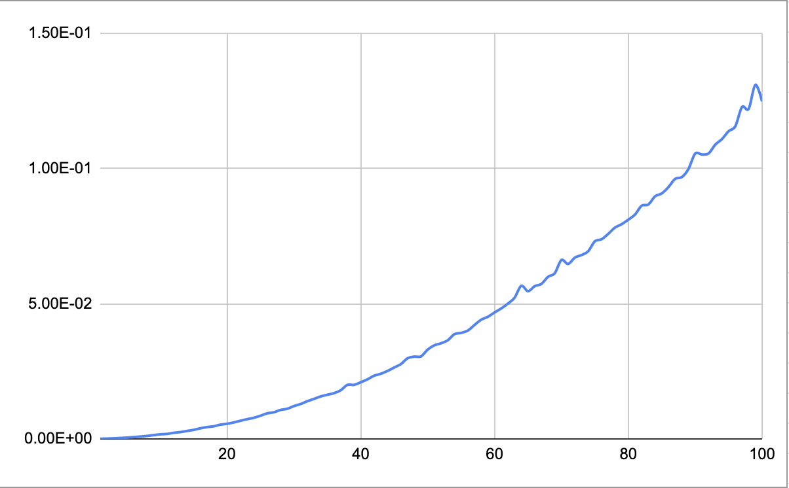

# Data Structures and Algorithms

## Binary Search Tree

Balanced Search Tree Implementation is located in the ```src/Tree.php``` and ```src/Node.php``` classes. Dataset generation and script entrypoint is ```bst.php```. 

Run ```php bst.php``` to run tests. Edit line 34 in ```bst.php``` to change the test case (insert, find, delete)

```php
/**
 * @return void
 * @throws Exception
 */
function process()
{
    $case = 'find';
```

```\Tree::printTree``` method can be used to print our the BST to the terminal. 

Got the following results on basic operations: 

### Insert

Time recorded for insertion of each dataset of 100 items adding to the existing one. 


### Delete


### Find



## Counting Sort

Implementation is in the ```csort.php``` file. Call ```php csort.php``` to run test. 

#### Initial dataset

Works the best when the range of the dataset items is not significantly bigger than the number of dataset items 

**Initial dataset**
4 6 4 0 1 6 0 9 3 9 0 5 0 0 6 2 0 0 7 5 6 4 5 1 0 1 9 3 1 4 6 9 1 6 5 9 6 3 8 4 8 4 5 10 0 9 4 3 6 3 2 6 3 3 10 8 7 7 10 9 1 2 4 7 6 3 6 4 4 5 7 0 6 7 1 0 4 6 2 8 7 3 5 9 3 5 5 2 6 8 5 10 8 0 2 6 10 3 0 6

**Sorted dataset**
0 0 0 0 0 0 0 0 0 0 0 0 0 1 1 1 1 1 1 1 2 2 2 2 2 2 3 3 3 3 3 3 3 3 3 3 3 4 4 4 4 4 4 4 4 4 4 4 5 5 5 5 5 5 5 5 5 5 6 6 6 6 6 6 6 6 6 6 6 6 6 6 6 6 7 7 7 7 7 7 7 8 8 8 8 8 8 9 9 9 9 9 9 9 9 10 10 10 10 10 

